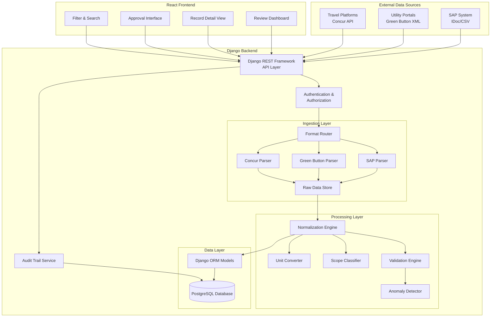
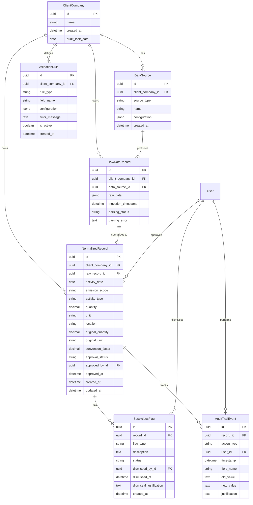
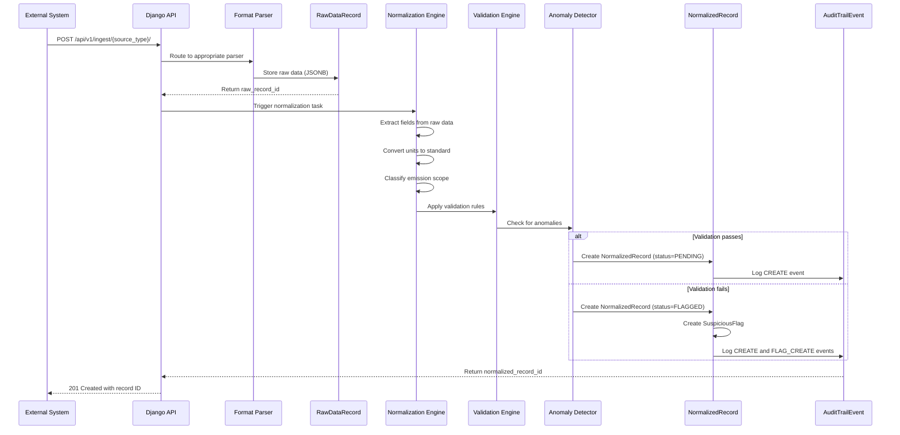

# Design Document: Breathe ESG Data Ingestion System

## Overview

The Breathe ESG Data Ingestion System is a multi-tenant Django REST API and React application that consolidates emissions and activity data from heterogeneous sources (SAP fuel/procurement systems, utility electricity portals, and corporate travel platforms) into a unified, auditable repository. The system normalizes diverse data formats, detects quality issues through statistical analysis, provides a review dashboard for ESG analysts, and implements an approval workflow to lock validated data for audit compliance.

### Key Design Principles

1. **Multi-Tenancy with Data Isolation**: Shared database with tenant identifier filtering ensures complete data separation between client companies
2. **Flexible Schema Design**: Raw data preservation with separate normalized representation accommodates diverse source formats without schema migrations
3. **Immutable Audit Trail**: Append-only event log captures all data modifications, approvals, and source attributions for compliance verification
4. **Statistical Quality Detection**: Automated anomaly detection using z-score analysis flags suspicious records for analyst review
5. **Source-Agnostic Ingestion**: Pluggable parser architecture supports SAP IDoc/CSV, Green Button XML, and Concur API formats with extensibility for future sources

### Research Summary

**SAP Data Formats**: SAP systems export fuel and procurement data via IDoc (Intermediate Document) format or CSV exports. IDocs follow a three-part structure (Control Record with metadata like message type and sender/receiver IDs, Data Records containing segment-based business data, and Status Records tracking processing state). For emissions tracking, relevant IDoc types include material movements (MATMAS for material master data) and procurement documents. CSV exports typically contain fields like material number, quantity, unit, cost center, and transaction date.

**Green Button Standard**: The Green Button Alliance defines an XML-based standard (ESPI - Energy Services Provider Interface) using Atom Syndication Format for utility electricity data. Key elements include `<UsagePoint>` (metering location), `<MeterReading>` (collection of interval data), `<IntervalBlock>` (time-series usage data), and `<ReadingType>` (measurement characteristics like unit, power of ten multiplier, and flow direction). The standard supports both Download My Data (DMD) for file exports and Connect My Data (CMD) for API-based access.

**SAP Concur Travel Data**: Concur provides travel booking and expense data through REST APIs. Trip data includes itinerary segments (flights, rail, car rental) with origin/destination, travel class, distance, and increasingly, ISO 14083-assured carbon emissions calculations. The API returns JSON structures with nested trip segments, each containing transportation mode, carrier, booking details, and calculated emissions values.

**Django Multi-Tenancy Patterns**: Three primary approaches exist: (1) Shared Database, Shared Schema with tenant identifier column (simplest, used here), (2) Shared Database, Separate Schemas (moderate isolation), and (3) Separate Databases per tenant (maximum isolation, highest complexity). The shared schema approach with row-level filtering provides adequate isolation for this use case while maintaining operational simplicity.

## Architecture

### System Architecture Diagram



### Component Responsibilities

**API Layer (Django REST Framework)**
- Exposes RESTful endpoints for data ingestion, retrieval, approval, and audit trail access
- Handles authentication via token-based auth (Django REST Framework TokenAuthentication)
- Enforces tenant-based authorization through custom permission classes
- Implements pagination, filtering, and sorting for list endpoints
- Returns standardized error responses with appropriate HTTP status codes

**Ingestion Layer**
- **Format Router**: Inspects request content-type and payload structure to route to appropriate parser
- **SAP Parser**: Parses IDoc XML structure (EDI_DC40 control record, hierarchical segments) and CSV formats with configurable column mappings
- **Green Button Parser**: Parses Atom/ESPI XML, extracting UsagePoint, MeterReading, IntervalBlock, and ReadingType elements
- **Concur Parser**: Consumes JSON from Concur API, extracting trip segments with travel mode, distance, and emissions data
- **Raw Data Store**: Persists unparsed input as JSONB for audit trail and reprocessing capability

**Processing Layer**
- **Normalization Engine**: Orchestrates transformation pipeline, applying unit conversion, scope classification, and validation
- **Unit Converter**: Converts measurements to standard units (e.g., gallons → liters, kWh → MWh, miles → kilometers) using configurable conversion factors
- **Scope Classifier**: Maps activity types to GHG Protocol scopes using rule-based logic (fuel combustion → Scope 1, purchased electricity → Scope 2, travel → Scope 3)
- **Validation Engine**: Applies configurable rules (required fields, numeric ranges, date ranges, enumerated values) per client company
- **Anomaly Detector**: Calculates z-scores for numeric fields against historical data per tenant and flags outliers (|z| > 3)

**Data Layer**
- Django ORM models with tenant identifier on all tables
- PostgreSQL database with JSONB columns for flexible raw data storage
- Database indexes on tenant_id, source_id, ingestion_date, and approval_status for query performance

**Audit Trail Service**
- Append-only event log capturing all mutations (create, update, approve, flag, dismiss)
- Records timestamp, user_id, record_id, field_name, old_value, new_value, and action_type
- Immutable design prevents tampering with historical records

**React Frontend**
- **Review Dashboard**: Tabular view with filtering by tenant, source, date range, scope, and status
- **Record Detail View**: Displays normalized data, raw data, source attribution, validation results, and audit history
- **Approval Interface**: Bulk and individual approval actions with confirmation dialogs for records with unresolved flags
- **Filter & Search**: Client-side and server-side filtering with URL state persistence

## Components and Interfaces

### API Endpoints

#### Data Ingestion

**POST /api/v1/ingest/sap/**
- Request: `multipart/form-data` with file upload or `application/json` with IDoc XML/CSV data
- Headers: `Authorization: Token <token>`, `X-Tenant-ID: <tenant_uuid>`
- Response: `201 Created` with ingestion job ID, or `400 Bad Request` with validation errors
- Behavior: Validates format, stores raw data, enqueues normalization task

**POST /api/v1/ingest/greenbutton/**
- Request: `application/xml` with Green Button Atom feed
- Headers: `Authorization: Token <token>`, `X-Tenant-ID: <tenant_uuid>`
- Response: `201 Created` with ingestion job ID, or `400 Bad Request` with parsing errors
- Behavior: Parses ESPI elements, extracts usage intervals, stores raw XML

**POST /api/v1/ingest/concur/**
- Request: `application/json` with Concur trip data
- Headers: `Authorization: Token <token>`, `X-Tenant-ID: <tenant_uuid>`
- Response: `201 Created` with ingestion job ID, or `400 Bad Request` with validation errors
- Behavior: Extracts trip segments, calculates emissions if not provided, stores raw JSON

#### Data Retrieval

**GET /api/v1/records/**
- Query Parameters: `tenant_id`, `source_type`, `start_date`, `end_date`, `scope`, `status` (pending/approved/flagged), `page`, `page_size`
- Response: `200 OK` with paginated list of normalized records
- Behavior: Filters by tenant and query params, returns summary fields (id, source, date, scope, status, value, unit)

**GET /api/v1/records/{id}/**
- Response: `200 OK` with full record details (normalized data, raw data, source attribution, validation results, audit trail)
- Behavior: Enforces tenant authorization, returns 404 if not found or unauthorized

**GET /api/v1/records/suspicious/**
- Query Parameters: `tenant_id`, `flag_type`, `page`, `page_size`
- Response: `200 OK` with paginated list of flagged records
- Behavior: Returns records with unresolved suspicious flags

**GET /api/v1/records/{id}/audit-trail/**
- Response: `200 OK` with chronological list of audit events for the record
- Behavior: Returns immutable event log with timestamps, users, and changes

#### Approval Workflow

**POST /api/v1/records/{id}/approve/**
- Request: `{"justification": "optional note"}`
- Response: `200 OK` with updated record, or `400 Bad Request` if unresolved flags exist
- Behavior: Marks record as approved, locks core fields, records audit event

**POST /api/v1/records/bulk-approve/**
- Request: `{"record_ids": [id1, id2, ...], "justification": "optional note"}`
- Response: `200 OK` with count of approved records, or `400 Bad Request` with list of records that failed validation
- Behavior: Approves multiple records atomically, skips records with unresolved flags unless force flag is set

**POST /api/v1/records/{id}/unapprove/**
- Request: `{"justification": "required note"}`
- Response: `200 OK` with updated record, or `403 Forbidden` if past audit lock date
- Behavior: Reverts approval status, unlocks fields, records audit event

**POST /api/v1/records/{id}/dismiss-flag/**
- Request: `{"flag_id": <id>, "justification": "required note"}`
- Response: `200 OK` with updated record
- Behavior: Marks suspicious flag as dismissed, records justification in audit trail

#### Statistics and Reporting

**GET /api/v1/statistics/summary/**
- Query Parameters: `tenant_id`, `start_date`, `end_date`
- Response: `200 OK` with summary counts (total_records, failed_records, suspicious_records, approved_records, pending_records)
- Behavior: Aggregates counts per tenant and date range

**GET /api/v1/statistics/by-scope/**
- Query Parameters: `tenant_id`, `start_date`, `end_date`
- Response: `200 OK` with breakdown by emission scope (scope_1_count, scope_2_count, scope_3_count)
- Behavior: Groups records by scope classification

#### Health and Monitoring

**GET /api/health/**
- Response: `200 OK` with `{"status": "healthy", "database": "connected", "timestamp": "ISO8601"}`
- Behavior: Checks database connectivity, returns service status

### Django Models

#### ClientCompany
```python
class ClientCompany(models.Model):
    id = models.UUIDField(primary_key=True, default=uuid.uuid4)
    name = models.CharField(max_length=255)
    created_at = models.DateTimeField(auto_now_add=True)
    audit_lock_date = models.DateField(null=True, blank=True)
    
    class Meta:
        db_table = 'client_companies'
        indexes = [models.Index(fields=['name'])]
```

#### DataSource
```python
class DataSource(models.Model):
    SOURCE_TYPES = [
        ('SAP_IDOC', 'SAP IDoc'),
        ('SAP_CSV', 'SAP CSV'),
        ('GREEN_BUTTON', 'Green Button XML'),
        ('CONCUR_API', 'Concur API'),
    ]
    
    id = models.UUIDField(primary_key=True, default=uuid.uuid4)
    client_company = models.ForeignKey(ClientCompany, on_delete=models.CASCADE)
    source_type = models.CharField(max_length=50, choices=SOURCE_TYPES)
    name = models.CharField(max_length=255)
    configuration = models.JSONField(default=dict)  # Parser-specific config
    created_at = models.DateTimeField(auto_now_add=True)
    
    class Meta:
        db_table = 'data_sources'
        indexes = [
            models.Index(fields=['client_company', 'source_type']),
        ]
```

#### RawDataRecord
```python
class RawDataRecord(models.Model):
    id = models.UUIDField(primary_key=True, default=uuid.uuid4)
    client_company = models.ForeignKey(ClientCompany, on_delete=models.CASCADE)
    data_source = models.ForeignKey(DataSource, on_delete=models.CASCADE)
    raw_data = models.JSONField()  # Unparsed input
    ingestion_timestamp = models.DateTimeField(auto_now_add=True)
    parsing_status = models.CharField(max_length=20, choices=[
        ('PENDING', 'Pending'),
        ('SUCCESS', 'Success'),
        ('FAILED', 'Failed'),
    ])
    parsing_error = models.TextField(null=True, blank=True)
    
    class Meta:
        db_table = 'raw_data_records'
        indexes = [
            models.Index(fields=['client_company', 'ingestion_timestamp']),
            models.Index(fields=['data_source', 'parsing_status']),
        ]
```

#### NormalizedRecord
```python
class NormalizedRecord(models.Model):
    EMISSION_SCOPES = [
        ('SCOPE_1', 'Scope 1: Direct Emissions'),
        ('SCOPE_2', 'Scope 2: Purchased Electricity'),
        ('SCOPE_3', 'Scope 3: Value Chain'),
    ]
    
    APPROVAL_STATUS = [
        ('PENDING', 'Pending Review'),
        ('APPROVED', 'Approved'),
        ('FLAGGED', 'Flagged for Review'),
    ]
    
    id = models.UUIDField(primary_key=True, default=uuid.uuid4)
    client_company = models.ForeignKey(ClientCompany, on_delete=models.CASCADE)
    raw_record = models.OneToOneField(RawDataRecord, on_delete=models.CASCADE)
    
    # Normalized fields
    activity_date = models.DateField()
    emission_scope = models.CharField(max_length=20, choices=EMISSION_SCOPES)
    activity_type = models.CharField(max_length=100)  # e.g., "fuel_combustion", "electricity_consumption", "air_travel"
    quantity = models.DecimalField(max_digits=15, decimal_places=4)
    unit = models.CharField(max_length=50)  # Standardized unit
    location = models.CharField(max_length=255, null=True, blank=True)
    
    # Source attribution
    original_quantity = models.DecimalField(max_digits=15, decimal_places=4)
    original_unit = models.CharField(max_length=50)
    conversion_factor = models.DecimalField(max_digits=10, decimal_places=6)
    
    # Workflow
    approval_status = models.CharField(max_length=20, choices=APPROVAL_STATUS, default='PENDING')
    approved_by = models.ForeignKey('auth.User', null=True, blank=True, on_delete=models.SET_NULL, related_name='approved_records')
    approved_at = models.DateTimeField(null=True, blank=True)
    
    # Metadata
    created_at = models.DateTimeField(auto_now_add=True)
    updated_at = models.DateTimeField(auto_now=True)
    
    class Meta:
        db_table = 'normalized_records'
        indexes = [
            models.Index(fields=['client_company', 'activity_date']),
            models.Index(fields=['client_company', 'emission_scope']),
            models.Index(fields=['client_company', 'approval_status']),
            models.Index(fields=['data_source', 'ingestion_timestamp']),
        ]
```

#### SuspiciousFlag
```python
class SuspiciousFlag(models.Model):
    FLAG_TYPES = [
        ('OUTLIER', 'Statistical Outlier'),
        ('MISSING_FIELD', 'Missing Required Field'),
        ('INVALID_DATE', 'Invalid Date Range'),
        ('CONVERSION_FAILURE', 'Unit Conversion Failed'),
        ('DUPLICATE', 'Duplicate Record'),
        ('VALIDATION_RULE', 'Validation Rule Violation'),
    ]
    
    FLAG_STATUS = [
        ('ACTIVE', 'Active'),
        ('DISMISSED', 'Dismissed'),
        ('RESOLVED', 'Resolved'),
    ]
    
    id = models.UUIDField(primary_key=True, default=uuid.uuid4)
    record = models.ForeignKey(NormalizedRecord, on_delete=models.CASCADE, related_name='flags')
    flag_type = models.CharField(max_length=50, choices=FLAG_TYPES)
    description = models.TextField()
    status = models.CharField(max_length=20, choices=FLAG_STATUS, default='ACTIVE')
    dismissed_by = models.ForeignKey('auth.User', null=True, blank=True, on_delete=models.SET_NULL)
    dismissed_at = models.DateTimeField(null=True, blank=True)
    dismissal_justification = models.TextField(null=True, blank=True)
    created_at = models.DateTimeField(auto_now_add=True)
    
    class Meta:
        db_table = 'suspicious_flags'
        indexes = [
            models.Index(fields=['record', 'status']),
        ]
```

#### AuditTrailEvent
```python
class AuditTrailEvent(models.Model):
    ACTION_TYPES = [
        ('CREATE', 'Record Created'),
        ('UPDATE', 'Record Updated'),
        ('APPROVE', 'Record Approved'),
        ('UNAPPROVE', 'Record Unapproved'),
        ('FLAG_CREATE', 'Flag Created'),
        ('FLAG_DISMISS', 'Flag Dismissed'),
    ]
    
    id = models.UUIDField(primary_key=True, default=uuid.uuid4)
    record = models.ForeignKey(NormalizedRecord, on_delete=models.CASCADE, related_name='audit_events')
    action_type = models.CharField(max_length=50, choices=ACTION_TYPES)
    user = models.ForeignKey('auth.User', on_delete=models.SET_NULL, null=True)
    timestamp = models.DateTimeField(auto_now_add=True)
    field_name = models.CharField(max_length=100, null=True, blank=True)
    old_value = models.TextField(null=True, blank=True)
    new_value = models.TextField(null=True, blank=True)
    justification = models.TextField(null=True, blank=True)
    
    class Meta:
        db_table = 'audit_trail_events'
        indexes = [
            models.Index(fields=['record', 'timestamp']),
            models.Index(fields=['user', 'timestamp']),
        ]
        ordering = ['-timestamp']
```

#### ValidationRule
```python
class ValidationRule(models.Model):
    RULE_TYPES = [
        ('NUMERIC_RANGE', 'Numeric Range'),
        ('REQUIRED_FIELD', 'Required Field'),
        ('DATE_RANGE', 'Date Range'),
        ('ENUM_VALUES', 'Enumerated Values'),
        ('CUSTOM', 'Custom Rule'),
    ]
    
    id = models.UUIDField(primary_key=True, default=uuid.uuid4)
    client_company = models.ForeignKey(ClientCompany, on_delete=models.CASCADE)
    rule_type = models.CharField(max_length=50, choices=RULE_TYPES)
    field_name = models.CharField(max_length=100)
    configuration = models.JSONField()  # e.g., {"min": 0, "max": 1000} or {"allowed_values": ["A", "B"]}
    error_message = models.TextField()
    is_active = models.BooleanField(default=True)
    created_at = models.DateTimeField(auto_now_add=True)
    
    class Meta:
        db_table = 'validation_rules'
        indexes = [
            models.Index(fields=['client_company', 'is_active']),
        ]
```

### React Component Structure

```
src/
├── components/
│   ├── Dashboard/
│   │   ├── RecordTable.tsx          # Main table with sorting, filtering
│   │   ├── FilterPanel.tsx          # Filter controls (date, source, scope, status)
│   │   ├── SummaryStats.tsx         # Statistics cards
│   │   └── BulkActions.tsx          # Bulk approval controls
│   ├── RecordDetail/
│   │   ├── RecordDetailView.tsx     # Full record display
│   │   ├── NormalizedDataPanel.tsx  # Normalized fields
│   │   ├── RawDataPanel.tsx         # Raw data JSON viewer
│   │   ├── AuditTrailPanel.tsx      # Audit history timeline
│   │   └── FlagsPanel.tsx           # Suspicious flags with dismiss actions
│   ├── Approval/
│   │   ├── ApprovalButton.tsx       # Single record approval
│   │   ├── BulkApprovalModal.tsx    # Bulk approval confirmation
│   │   └── UnapprovalModal.tsx      # Unapproval with justification
│   └── Common/
│       ├── Pagination.tsx
│       ├── DateRangePicker.tsx
│       └── StatusBadge.tsx
├── services/
│   ├── api.ts                       # Axios client with auth interceptor
│   ├── recordsService.ts            # API calls for records
│   ├── approvalService.ts           # API calls for approval workflow
│   └── statisticsService.ts         # API calls for statistics
├── hooks/
│   ├── useRecords.ts                # React Query hook for records
│   ├── useFilters.ts                # URL state management for filters
│   └── useApproval.ts               # Approval workflow logic
├── types/
│   ├── Record.ts
│   ├── Flag.ts
│   └── AuditEvent.ts
└── App.tsx
```

## Data Models

### Entity-Relationship Diagram



### Data Flow: Ingestion to Approval



### Unit Conversion Logic

The system maintains a conversion table for common unit transformations:

**Volume Conversions**
- Gallons (US) → Liters: multiply by 3.78541
- Gallons (UK) → Liters: multiply by 4.54609
- Cubic meters → Liters: multiply by 1000

**Energy Conversions**
- kWh → MWh: divide by 1000
- BTU → kWh: multiply by 0.000293071
- Therms → kWh: multiply by 29.3001

**Distance Conversions**
- Miles → Kilometers: multiply by 1.60934
- Nautical miles → Kilometers: multiply by 1.852

**Mass Conversions**
- Pounds → Kilograms: multiply by 0.453592
- Short tons → Metric tonnes: multiply by 0.907185

The `UnitConverter` class implements a registry pattern where conversion functions are registered by source-target unit pairs. Custom conversions can be added per client company via the `DataSource.configuration` JSONB field.

### Emission Scope Classification Rules

**Scope 1 (Direct Emissions)**
- Activity types: `fuel_combustion`, `refrigerant_leak`, `process_emissions`, `fugitive_emissions`
- Data sources: SAP fuel procurement records, facility management systems
- Indicators: Fuel type fields (diesel, natural gas, propane), combustion equipment identifiers

**Scope 2 (Purchased Electricity)**
- Activity types: `electricity_consumption`, `purchased_steam`, `purchased_heating`, `purchased_cooling`
- Data sources: Utility Green Button data, electricity invoices
- Indicators: kWh measurements, utility meter IDs, grid connection points

**Scope 3 (Value Chain)**
- Activity types: `air_travel`, `rail_travel`, `car_rental`, `hotel_stay`, `purchased_goods`, `waste_disposal`, `employee_commute`
- Data sources: Concur travel data, procurement systems, waste management records
- Indicators: Travel booking records, supplier invoices, transportation mode

The `ScopeClassifier` applies rule-based logic using activity type keywords and data source type. Ambiguous cases (e.g., electricity generation on-site vs. purchased) are flagged for manual review.

### Anomaly Detection Algorithm

The `AnomalyDetector` uses z-score analysis to identify statistical outliers:

1. **Historical Baseline Calculation**: For each combination of (client_company, activity_type, unit), calculate mean (μ) and standard deviation (σ) from approved historical records in the past 12 months
2. **Z-Score Computation**: For new record with value x, compute z = (x - μ) / σ
3. **Threshold Application**: Flag record if |z| > 3 (more than 3 standard deviations from mean)
4. **Minimum Sample Size**: Require at least 30 historical records before applying statistical detection; otherwise, skip anomaly check
5. **Edge Case Handling**: If σ = 0 (all historical values identical), flag any new value that differs

Additional heuristic checks:
- **Missing Required Fields**: Flag if any field marked as required in ValidationRule is null or empty
- **Date Range**: Flag if activity_date is in the future or more than 5 years in the past
- **Duplicate Detection**: Flag if another record exists with same (data_source, source_identifier, activity_date) tuple
- **Unrealistic Conversions**: Flag if unit conversion produces negative value or value exceeding physical limits (e.g., >100% efficiency)


## Correctness Properties

*A property is a characteristic or behavior that should hold true across all valid executions of a system—essentially, a formal statement about what the system should do. Properties serve as the bridge between human-readable specifications and machine-verifiable correctness guarantees.*

### Reflection on Redundancy

After analyzing all acceptance criteria, I identified the following property categories:

**Parsing Properties (1.1-1.6)**: These test that parsers correctly handle various input formats and preserve raw data. Properties 1.1, 1.2, 1.3 can be combined into a single universal parsing property since they test the same behavior across different formats.

**Multi-Tenancy Properties (3.1-3.3, 14.4)**: These test tenant isolation. Properties 3.2 and 14.4 are redundant—both verify that users only access their authorized tenant's data. They can be combined.

**Normalization Properties (4.1-4.7)**: These test unit conversion and data preservation. Property 4.2 and 4.7 both verify preservation of original values—they can be combined into a single round-trip property.

**Scope Classification Properties (5.1-5.3)**: These test emission scope assignment rules. They can remain separate as they test distinct classification logic for different activity types.

**Anomaly Detection Properties (7.1, 7.2, 7.5)**: These test different flagging mechanisms. They should remain separate as each tests a distinct detection algorithm.

**Approval Workflow Properties (8.2, 8.3, 8.5)**: These test approval state transitions and constraints. Property 8.3 (immutability) and 8.5 (flag resolution) are distinct invariants that should remain separate.

**Audit Trail Properties (9.1, 9.2, 9.5, 9.7)**: Properties 9.1 and 9.7 both test audit event creation for modifications—they can be combined. Property 9.2 tests source attribution (different concern). Property 9.5 tests immutability (different concern).

**Authentication Properties (14.1)**: Tests auth enforcement universally across endpoints.

**Validation Properties (15.6)**: Tests validation rule enforcement.

After reflection, I will consolidate redundant properties and write distinct, non-overlapping correctness properties.

### Property 1: Parser Format Compliance

*For any* valid input data in a supported format (SAP IDoc, SAP CSV, Green Button XML, or Concur JSON), the ingestion service SHALL successfully parse the data and extract all defined fields without errors.

**Validates: Requirements 1.1, 1.2, 1.3**

### Property 2: Raw Data Preservation

*For any* ingested data, the system SHALL store the exact original input in the raw_data field before any transformation, and this raw data SHALL remain retrievable throughout the record's lifecycle.

**Validates: Requirements 1.4**

### Property 3: Parsing Failure Handling

*For any* malformed or invalid input data, the ingestion service SHALL create a failure record with parsing_status='FAILED', populate the parsing_error field with a descriptive error message, and preserve the raw input data.

**Validates: Requirements 1.5**

### Property 4: Source Attribution Completeness

*For any* ingested record, the system SHALL associate it with a non-null Data_Source identifier, a non-null ingestion timestamp, and a reference to the raw data record.

**Validates: Requirements 1.6, 9.2**

### Property 5: Tenant Association Invariant

*For any* data record created in the system, the record SHALL be associated with exactly one non-null Client_Company identifier.

**Validates: Requirements 3.1**

### Property 6: Tenant Isolation

*For any* query executed by a user authorized for Client_Company A, the system SHALL return only records where client_company_id equals A, and SHALL reject attempts to access records belonging to other Client_Company identifiers with appropriate authorization errors.

**Validates: Requirements 3.2, 3.3, 14.4**

### Property 7: Unit Conversion Correctness

*For any* record with a quantity in a non-standard unit that has a defined conversion to a standard unit, the normalization engine SHALL convert the value using the correct conversion factor, and the normalized quantity SHALL equal the original quantity multiplied by the conversion factor (within floating-point precision tolerance).

**Validates: Requirements 4.1**

### Property 8: Normalization Round-Trip Preservation

*For any* normalized record, the system SHALL preserve the original_quantity, original_unit, and conversion_factor such that original_quantity equals quantity divided by conversion_factor (within floating-point precision tolerance).

**Validates: Requirements 4.2, 4.7**

### Property 9: Conversion Failure Flagging

*For any* record with a unit that cannot be converted to a standard unit (unknown unit, ambiguous conversion, or conversion producing invalid result), the normalization engine SHALL create a SuspiciousFlag with flag_type='CONVERSION_FAILURE' and a descriptive error message.

**Validates: Requirements 4.3**

### Property 10: Date Format Standardization

*For any* record with a date value in a recognized format, the normalization engine SHALL convert it to ISO 8601 format (YYYY-MM-DD) and store it in the activity_date field.

**Validates: Requirements 4.4**

### Property 11: Scope 1 Classification

*For any* record where the activity_type contains keywords indicating direct emissions (fuel_combustion, refrigerant_leak, process_emissions, fugitive_emissions), the normalization engine SHALL assign emission_scope='SCOPE_1'.

**Validates: Requirements 5.1**

### Property 12: Scope 2 Classification

*For any* record where the activity_type indicates purchased energy (electricity_consumption, purchased_steam, purchased_heating, purchased_cooling), the normalization engine SHALL assign emission_scope='SCOPE_2'.

**Validates: Requirements 5.2**

### Property 13: Scope 3 Classification

*For any* record where the activity_type indicates value chain activities (air_travel, rail_travel, car_rental, hotel_stay, purchased_goods, waste_disposal, employee_commute), the normalization engine SHALL assign emission_scope='SCOPE_3'.

**Validates: Requirements 5.3**

### Property 14: Statistical Outlier Detection

*For any* numeric field in a record, if the system has at least 30 historical approved records for the same (client_company, activity_type, unit) combination, and the new value's z-score exceeds 3 in absolute value, the system SHALL create a SuspiciousFlag with flag_type='OUTLIER'.

**Validates: Requirements 7.1**

### Property 15: Required Field Validation

*For any* record where a field marked as required by a ValidationRule is null or empty, the system SHALL create a SuspiciousFlag with flag_type='MISSING_FIELD' and reference the specific field name.

**Validates: Requirements 7.2**

### Property 16: Duplicate Detection

*For any* pair of records with identical (data_source_id, source_identifier, activity_date) tuples, the system SHALL flag the second record with a SuspiciousFlag of flag_type='DUPLICATE'.

**Validates: Requirements 7.5**

### Property 17: Approval State Transition

*For any* record that is approved by an analyst, the system SHALL set approval_status='APPROVED', populate approved_by with the analyst's user identifier, populate approved_at with the current timestamp, and create an AuditTrailEvent with action_type='APPROVE'.

**Validates: Requirements 8.2**

### Property 18: Approved Record Immutability

*For any* record where approval_status='APPROVED', attempts to modify core data fields (quantity, unit, activity_date, emission_scope, activity_type) SHALL be rejected with an appropriate error.

**Validates: Requirements 8.3**

### Property 19: Flag Resolution Requirement

*For any* record with at least one SuspiciousFlag where status='ACTIVE', attempts to approve the record SHALL fail with a validation error unless the approval request includes an explicit force flag or confirmation.

**Validates: Requirements 8.5**

### Property 20: Modification Audit Trail

*For any* modification to a record's field, the system SHALL create an AuditTrailEvent with action_type='UPDATE', the field_name, the old_value (value before modification), the new_value (value after modification), the user identifier, and a timestamp.

**Validates: Requirements 9.1, 9.7**

### Property 21: Audit Trail Immutability

*For any* AuditTrailEvent record, attempts to modify or delete the record SHALL be rejected by the system, ensuring the audit trail remains append-only.

**Validates: Requirements 9.5**

### Property 22: Authentication Enforcement

*For any* API endpoint except health check endpoints, requests without a valid authentication token SHALL receive a 401 Unauthorized response.

**Validates: Requirements 14.1**

### Property 23: Validation Rule Enforcement

*For any* ValidationRule that is active for a Client_Company, when a record violates the rule's constraints (numeric range, required field, date range, or enumerated values), the system SHALL create a SuspiciousFlag with flag_type='VALIDATION_RULE' and include the rule's error message in the description.

**Validates: Requirements 15.6**

## Error Handling

### Error Categories and Responses

**Parsing Errors (400 Bad Request)**
- Malformed XML/JSON structure
- Missing required format elements (e.g., Green Button missing UsagePoint)
- Invalid data types (e.g., non-numeric value in quantity field)
- Response includes specific parsing error message and preserves raw input

**Validation Errors (400 Bad Request)**
- Unit conversion failures (unknown unit, ambiguous conversion)
- Date format not recognized
- Required fields missing
- Validation rule violations
- Response includes list of validation errors with field names and error messages

**Authorization Errors (401 Unauthorized, 403 Forbidden)**
- Missing or invalid authentication token (401)
- Attempt to access records from unauthorized tenant (403)
- Attempt to perform action without required role (403)
- Response includes error type and required permission

**Not Found Errors (404 Not Found)**
- Record ID does not exist
- Record exists but belongs to different tenant (treated as not found for security)
- Response includes generic "not found" message without revealing existence

**Conflict Errors (409 Conflict)**
- Attempt to approve record with unresolved flags (without force flag)
- Attempt to modify approved record
- Attempt to unapprove record past audit lock date
- Response includes conflict reason and resolution options

**Server Errors (500 Internal Server Error)**
- Database connection failures
- Unexpected exceptions in normalization pipeline
- External service timeouts (if applicable)
- Response includes generic error message; detailed error logged server-side

### Error Recovery Strategies

**Parsing Failures**: System creates RawDataRecord with parsing_status='FAILED' and preserves raw input. Analysts can view failed records in dashboard, correct source data, and re-ingest.

**Normalization Failures**: System creates NormalizedRecord with approval_status='FLAGGED' and SuspiciousFlag describing the issue. Analysts can dismiss flags with justification or correct data manually.

**Transient Database Errors**: API endpoints implement retry logic with exponential backoff for transient connection errors. After 3 retries, return 500 error to client.

**Validation Rule Conflicts**: When multiple validation rules conflict, system creates separate SuspiciousFlag for each violation. Analysts resolve flags individually.

**Audit Trail Integrity**: AuditTrailEvent model uses database-level constraints (immutable table, append-only permissions) to prevent accidental or malicious modification. Any attempt to modify audit records fails at database level.

## Testing Strategy

### Dual Testing Approach

The system requires both **unit tests** for specific examples and edge cases, and **property-based tests** for universal correctness properties across all inputs.

**Unit Tests** focus on:
- Specific parsing examples for each data format (SAP IDoc with known structure, Green Button XML with specific UsagePoint configuration, Concur JSON with multi-segment trip)
- Edge cases: empty files, single-record files, maximum field lengths, special characters in text fields
- Integration points: API endpoint request/response formats, authentication middleware, database transaction boundaries
- Error conditions: specific malformed inputs, specific validation rule violations, specific authorization scenarios

**Property-Based Tests** focus on:
- Universal properties that hold for all valid inputs (see Correctness Properties section above)
- Comprehensive input coverage through randomization (random quantities, random units, random dates, random tenant IDs)
- Invariants that must hold regardless of input (tenant isolation, audit trail immutability, raw data preservation)

### Property-Based Testing Configuration

**Framework**: Use **Hypothesis** (Python property-based testing library) for Django backend tests

**Iteration Count**: Minimum **100 iterations** per property test to ensure comprehensive input coverage

**Test Tagging**: Each property test MUST include a comment referencing the design document property:
```python
# Feature: breathe-esg-data-ingestion, Property 7: Unit Conversion Correctness
@given(quantity=st.floats(min_value=0.01, max_value=1e6),
       source_unit=st.sampled_from(['gallons', 'kWh', 'miles']),
       target_unit=st.sampled_from(['liters', 'MWh', 'kilometers']))
def test_unit_conversion_correctness(quantity, source_unit, target_unit):
    # Test implementation
    pass
```

**Generator Strategies**:
- **SAP Data**: Generate random IDoc structures with varying segment counts, field types, and nesting levels
- **Green Button Data**: Generate random Atom feeds with varying UsagePoint counts, IntervalBlock sizes, and ReadingType configurations
- **Concur Data**: Generate random trip JSON with varying segment counts, travel modes, and emission values
- **Quantities**: Generate random floats in realistic ranges (0.01 to 1e6) with varying precision
- **Units**: Sample from defined unit lists (volume, energy, distance, mass)
- **Dates**: Generate random dates within valid range (5 years past to present)
- **Tenant IDs**: Generate random UUIDs for multi-tenant test scenarios

### Integration Testing

**API Endpoint Tests**: Use Django REST Framework's APITestCase to test full request/response cycles with authentication, authorization, and database persistence

**Database Transaction Tests**: Verify atomic operations (bulk approval, normalization pipeline) either fully succeed or fully rollback

**Multi-Tenancy Tests**: Create records for multiple tenants, verify queries return only authorized records, verify cross-tenant access attempts fail

**Audit Trail Tests**: Perform sequences of operations (create, update, approve, unapprove), verify complete audit trail with correct event ordering

### Performance Testing

**Ingestion Throughput**: Test ingestion of 1000+ records in single batch, measure processing time and memory usage

**Query Performance**: Test dashboard queries with 100k+ records, verify response time under 2 seconds with proper indexing

**Anomaly Detection Performance**: Test z-score calculation with 10k+ historical records, verify acceptable performance (under 1 second per record)

### Security Testing

**Authentication Bypass Attempts**: Test all protected endpoints without auth token, verify 401 responses

**Authorization Bypass Attempts**: Test cross-tenant access with valid auth but wrong tenant, verify 403/404 responses

**SQL Injection**: Test API inputs with SQL injection payloads, verify Django ORM prevents injection

**XSS Prevention**: Test text fields with XSS payloads, verify React frontend escapes output

### Deployment Testing

**Health Check**: Verify `/api/health/` endpoint returns 200 with database connectivity status

**Environment Configuration**: Verify application reads configuration from environment variables (database URL, secret key, allowed hosts)

**Static File Serving**: Verify React frontend assets are served correctly from Django static files

**Database Migrations**: Verify migrations apply cleanly to empty database and to database with existing data

